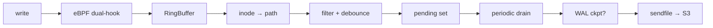

# Hoard — eBPF file-change replication daemon

Zero-copy file backup to S3, hooked at the VFS layer. No application
changes needed.



## Key features

- **Dual VFS hook**: `fentry/vfs_write` (pwrite64/SQLite) +
  `fentry/generic_perform_write` (write/dd/echo) — catches every
  buffered write on any filesystem (ext4, tmpfs, btrfs, …)
- **Zero-copy upload**: `sendfile(2)` from page cache straight to TLS socket
- **SQLite auto-detect**: WAL checkpoint (TRUNCATE→PASSIVE backoff) for `.db`
  files; transparent pass-through for logs, JSON, CSV, or any regular file
- **S3 key preserves directory structure**: `{prefix}/{relpath}/{filename}`
- **BTF CO-RE**: One BPF object, any kernel ≥ 5.5
- **Dual-mode**: standalone (control socket + periodic drain 30s) or
  Nomad system job (SSE lifecycle + periodic drain 10min)
- **Recursive directory scan**: Litestream-style initial walk + 30min
  periodic rescan catches files created but never written to
- **Deferred upload**: Files still changing are queued anyway; the
  periodic drain uploads them when settled

## Quickstart

```bash
# Build
cargo build --release

# Run (standalone mode)
HOARD_MODE=standalone \
HOARD_WATCH_ROOT=/var/lib/hoard/volumes \
HOARD_S3_ENDPOINT=http://127.0.0.1:9000 \
HOARD_S3_BUCKET=my-backups \
HOARD_S3_ACCESS_KEY=xxx \
HOARD_S3_SECRET_KEY=yyy \
HOARD_S3_PREFIX=hoard \
./target/release/hoard

# Run (Nomad mode)
HOARD_NOMAD_ADDR=http://127.0.0.1:4646 \
HOARD_NOMAD_TOKEN=xxx \
./target/release/hoard --mode nomad \
  --watch-root /var/lib/hoard/volumes \
  --s3-endpoint http://127.0.0.1:9000 \
  --s3-bucket my-backups

# Or use a TOML config
./target/release/hoard --config hoard.toml
```

## Configuration

```toml
[daemon]
mode = "standalone"           # "standalone" or "nomad"
service = "myapp"             # logical service name (standalone)
control_socket = "/run/hoard/<service>.sock"  # Unix domain socket
# metrics_addr = "0.0.0.0:9150"              # Prometheus

[watch]
path = "/var/lib/hoard/volumes"

[s3]
endpoint   = "http://127.0.0.1:9000"
bucket     = "guardian-backups"
region     = "us-east-1"
prefix     = "hoard"
access_key = "${S3_ACCESS_KEY}"              # env var expansion
secret_key = "${S3_SECRET_KEY}"
# no_sign = false                            # skip SigV4 for MinIO

[gc]
interval_secs = 21600    # 6h
ttl_days      = 30

[filter]
extensions = ["db", "sqlite", "sqlite3", "log", "json", "csv", "parquet"]
exclude    = ["*.tmp", "*.journal"]

[nomad]
addr  = "http://127.0.0.1:4646"
token = "${NOMAD_TOKEN}"
```

All TOML values support `${ENV_VAR}` expansion. CLI flags and env vars
override TOML values. Priority: CLI flag > env var > TOML > default.

## Requirements

| Component | Minimum |
|-----------|---------|
| Linux kernel | 5.5 (BPF trampoline) |
| Rust | 1.82 |
| clang | any (for BPF C) |
| S3 backend | any S3-compatible (MinIO, Garage, AWS, …) |

## Architecture

```
┌─────────────┐    ┌──────────────────────┐    ┌───────────┐
│  app write  │───▶│  BPF fentry          │───▶│ RingBuf   │
│  (any file) │    │  vfs_write            │    │  (shared) │
│             │    │  generic_perform_write│    │           │
└─────────────┘    └──────────────────────┘    └─────┬─────┘
                                                     │
                                              ┌──────▼──────┐
                                              │  userspace  │
                                              │  poll loop  │
                                              └──────┬──────┘
                                                     │
                        ┌────────────────────────────┼──────────┐
                        ▼                            ▼          ▼
                  ┌──────────┐           ┌──────────────┐  ┌──────────┐
                  │ inode →  │           │  debounce    │  │  filter  │
                  │ path     │           │  (100ms)     │  │  (glob)  │
                  └────┬─────┘           └──────┬───────┘  └────┬─────┘
                       │                        │               │
                       └────────────────────────┼───────────────┘
                                                ▼
                                         ┌──────────────┐
                                         │ pending set  │
                                         └──────┬───────┘
                                                │
                              ┌─────────────────┼──────────────────┐
                              ▼                 ▼                  ▼
                        periodic drain    trigger flush      SIGTERM drain
                        (30s / 10min)     (Unix socket)      (graceful exit)
                              │                 │                  │
                              └────────┬────────┘────────────────┘
                                       ▼
                                ┌──────────────┐     ┌───────────┐
                                │ WAL ckpt?    │────▶│ sendfile  │──▶ S3
                                │ (SQLite)     │pass │ (zero-    │
                                └──────────────┘     │  copy)    │
                                                      └───────────┘
```

## Nomad Deployment

```hcl
job "hoard" {
  type = "system"

  group "hoard" {
    task "hoard" {
      driver = "exec"

      config {
        command = "/usr/local/bin/hoard"
        args    = ["--config", "local/hoard.toml"]
      }

      artifact {
        source      = "https://github.com/hoard-project/hoard/releases/download/v0.5.0/hoard-linux-amd64.xz"
        destination = "local/hoard.xz"
      }

      template {
        data        = <<EOF
[daemon]
mode = "standalone"
service = "{{ env "NOMAD_ALLOC_NAME" }}"

[watch]
path = "/var/lib/hoard/volumes"

[s3]
endpoint   = "{{ env "S3_ENDPOINT" }}"
bucket     = "{{ env "S3_BUCKET" }}"
access_key = "{{ env "S3_ACCESS_KEY" }}"
secret_key = "{{ env "S3_SECRET_KEY" }}"
prefix     = "hoard"

[gc]
interval_secs = 21600
ttl_days      = 30
EOF
        destination = "local/hoard.toml"
      }

      env {
        S3_ENDPOINT   = "http://127.0.0.1:9000"
        S3_BUCKET     = "guardian-backups"
        S3_ACCESS_KEY = ""   # use Vault or Nomad variables
        S3_SECRET_KEY = ""   # use Vault or Nomad variables
      }

      resources {
        cpu    = 100   # BPF + ringbuf polling is lightweight
        memory = 64    # 30MB RSS typical, 64MB headroom
      }

      kill_timeout = "30s"   # allow pending uploads to drain
    }
  }
}
```

See [`contrib/nomad/`](contrib/nomad/) for production job specs with
S3-compatible storage, restore sidecars, and Vault integration.

## License

GPL-3.0

## Status

Production-ready. Validated on Linux 6.1 & 6.12 (ext4), sustained
stress tested: 50 concurrent DBs, 10 MB sendfile, recursive directories,
30s periodic drain, zero-copy upload to MinIO.