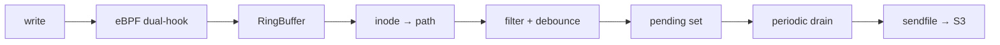

# Hoard — eBPF file-change replication daemon

[](https://github.com/hoard-project/hoard/actions/workflows/ci.yml)
[](https://github.com/hoard-project/hoard/actions/workflows/security.yml)
[](https://github.com/hoard-project/hoard/releases)
[](LICENSE)
[](https://scorecard.dev/viewer/?uri=github.com/hoard-project/hoard)

Zero-copy file backup to S3, hooked at the VFS layer. No application
changes needed.



## Key features

- **Dual VFS hook**: `fentry/vfs_write` + `fentry/generic_perform_write`
  catches every buffered write on ext4, tmpfs, btrfs, xfs
- **Zero-copy upload**: `sendfile(2)` from page cache straight to TLS socket
- **SQLite auto-detect**: WAL checkpoint for `.db` files; transparent for others
- **S3 key preserves directory structure**: `{prefix}/{relpath}/{filename}`
- **BTF CO-RE**: one BPF object, any kernel ≥ 5.5
- **Dual-mode**: standalone (control socket) or Nomad system job (SSE events)
- **v2 StorageClass + Volume model**: per-volume TTL, retries, compression,
  S3 routing, on-stop/on-delete lifecycle

## Quickstart

```bash
# Download
curl -sL https://github.com/hoard-project/hoard/releases/latest/download/hoard-x86_64 \
  -o /usr/local/bin/hoard
curl -sL https://github.com/hoard-project/hoard/releases/latest/download/hoard-x86_64.bpf.o \
  -o /usr/lib/hoard/hoard.bpf.o
chmod +x /usr/local/bin/hoard

# Run
HOARD_MODE=standalone \
HOARD_WATCH_ROOT=/var/lib/hoard/volumes \
HOARD_S3_ENDPOINT=http://127.0.0.1:9000 \
HOARD_S3_BUCKET=my-backups \
HOARD_S3_ACCESS_KEY=xxx \
HOARD_S3_SECRET_KEY=yyy \
  hoard
```

→ **[Full documentation](https://hoard-project.github.io/hoard/)**

## Project status

**v1.0.0** — Production-ready. Verified on Linux 6.1 & 6.12, dual-node
Nomad cluster. Passes `cargo test`, `cargo clippy`, CodeQL, and 61-object
S3 integration stress test.

## Requirements

| Component | Minimum |
|-----------|---------|
| Linux kernel | 5.5 (BPF trampoline + BTF) |
| Rust | 1.82 (MSRV) |
| S3 backend | any S3-compatible storage |

## Community

- [**Documentation**](https://hoard-project.github.io/hoard/)
- [**Discussions**](https://github.com/hoard-project/hoard/discussions)
- [**Issues**](https://github.com/hoard-project/hoard/issues)
- [**Contributing**](CONTRIBUTING.md)
- [**Code of Conduct**](CODE_OF_CONDUCT.md)

## Security

See [SECURITY.md](SECURITY.md) for reporting vulnerabilities, supported
versions, and the security model. CodeQL and `cargo audit` run on every PR.

## Governance

Hoard follows a BDFL + Maintainer model. See [GOVERNANCE.md](GOVERNANCE.md)
and [MAINTAINERS.md](MAINTAINERS.md).

## License

GPL-3.0 — see [LICENSE](LICENSE).
