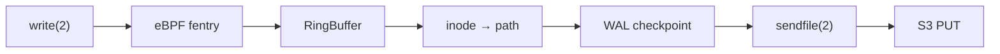

# Hoard — eBPF + io_uring SQLite backup daemon

Zero-copy file change replication to S3. Hooked at the VFS layer, no
application changes needed.



## Design

- **VFS hook**: BPF `fentry/vfs_write` — catches every `write(2)` regardless of
  filesystem (ext4, tmpfs, btrfs, …)
- **Zero-copy upload**: `sendfile(2)` from page cache straight to TLS socket
- **SQLite-aware**: WAL checkpoint before upload ensures crash-safe snapshot
- **BTF CO-RE**: One BPF object, any kernel ≥ 5.5
- **Dual-mode**: standalone (control socket) or Nomad system job (SSE lifecycle)

## Quickstart

```bash
# Build
cargo build --release

# Run (standalone mode)
./target/release/hoard --config hoard.toml

# Run (Nomad mode)
HOARD_NOMAD_TOKEN=... ./target/release/hoard \
  --mode nomad --nomad-addr http://127.0.0.1:4646 \
  --watch-root /opt/hoard-watch \
  --s3-endpoint https://s3.amazonaws.com \
  --s3-bucket my-backups
```

## Configuration

```toml
[daemon]
mode = "standalone"

[watch]
path = "/opt/hoard-watch"

[s3]
endpoint    = "https://s3.amazonaws.com"
bucket      = "my-backups"
region      = "us-east-1"
prefix      = "prod"
access_key  = "${S3_ACCESS_KEY}"
secret_key  = "${S3_SECRET_KEY}"

[gc]
interval_secs = 21600
ttl_days      = 30

[filter]
extensions = ["db", "sqlite", "sqlite3"]
exclude    = ["*.tmp", "*.journal"]
```

## Requirements

| Component | Minimum |
|-----------|---------|
| Linux kernel | 5.5 (BPF trampoline) |
| Rust | 1.82 |
| clang | any (for BPF C) |
| S3 backend | any S3-compatible (MinIO, Garage, AWS, …) |

## Architecture

```
┌─────────────┐    ┌──────────────┐    ┌───────────┐
│  sqlite3    │───▶│  BPF fentry  │───▶│ RingBuf   │
│  write(2)   │    │  vfs_write   │    │  (shared) │
└─────────────┘    └──────────────┘    └─────┬─────┘
                                             │
                                      ┌──────▼──────┐
                                      │  userspace  │
                                      │  poll loop  │
                                      └──────┬──────┘
                                             │
                    ┌────────────────────────┼──────────────────────┐
                    ▼                        ▼                      ▼
              ┌──────────┐           ┌──────────────┐       ┌──────────┐
              │ inode →  │           │  debounce    │       │  filter  │
              │ path     │           │  (100ms)     │       │  (glob)  │
              └────┬─────┘           └──────┬───────┘       └────┬─────┘
                   │                        │                    │
                   └────────────────────────┼────────────────────┘
                                            ▼
                                     ┌──────────────┐
                                     │ WAL checkpoint│
                                     └──────┬───────┘
                                            ▼
                                     ┌──────────────┐
                                     │  sendfile(2) │
                                     │  → TLS socket│
                                     └──────┬───────┘
                                            ▼
                                     ┌──────────────┐
                                     │  S3 (SigV4)  │
                                     └──────────────┘
```

## Nomad Deployment

```hcl
job "hoard" {
  type = "system"

  group "hoard" {
    task "hoard" {
      driver = "raw_exec"

      config {
        command = "/usr/local/bin/hoard"
        args    = ["--config", "${NOMAD_TASK_DIR}/hoard.toml"]
      }

      template {
        data        = <<EOF
[watch]
path = "/opt/hoard-watch"
[s3]
endpoint    = "{{ env "S3_ENDPOINT" }}"
bucket      = "{{ env "S3_BUCKET" }}"
access_key  = "{{ env "S3_ACCESS_KEY" }}"
secret_key  = "{{ env "S3_SECRET_KEY" }}"
EOF
        destination = "${NOMAD_TASK_DIR}/hoard.toml"
      }
    }
  }
}
```

See [`contrib/nomad/`](contrib/nomad/) for full job specs.

## License

GPL-3.0

## Status

Pre-release. Core pipeline validated on Linux 6.1 & 6.12 (ext4, tmpfs).
Production hardening in progress.
