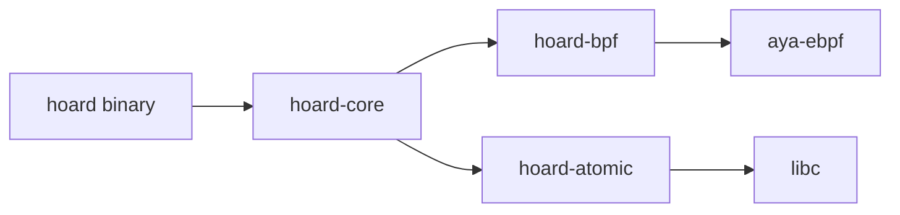

# Architecture

```mermaid
flowchart TB
    subgraph Userspace
        APP[Application]
    end

    subgraph Kernel
        VFS[VFS Layer]
        BPF1[fentry/vfs_write]
        BPF2[fentry/generic_perform_write]
        RB[RingBuffer<br/>256 KiB]
    end

    subgraph Hoard
        EVT[Event Loop<br/>tokio epoll]
        DEB[Debouncer<br/>100ms]
        PATH[inode→path<br/>procfs /proc/self/fd]
        PEND[Pending Set<br/>SQLite]
        DRAIN[Periodic Drain<br/>30s]
        GC[GC Worker<br/>6h]
        MET[Metrics<br/>http :9150]
    end

    subgraph "S3 (MinIO / AWS)"
        BKT[(Bucket)]
    end

    APP -->|write()| VFS
    VFS --> BPF1
    VFS --> BPF2
    BPF1 --> RB
    BPF2 --> RB
    RB --> EVT
    EVT --> PATH
    PATH --> DEB
    DEB --> PEND
    PEND --> DRAIN
    DRAIN -->|sendfile(2)| BKT
    GC -->|DeleteObject| BKT
    MET --- EVT
    MET --- DRAIN
```

## Data flow

### 1. BPF hook (kernel)

Two `fentry` hooks to catch buffered writes at the lowest VFS layer:

| Hook | Purpose |
|------|---------|
| `fentry/vfs_write` | Primary write entry — catches most file writes |
| `fentry/generic_perform_write` | Generic write fallback — ext4/tmpfs/btrfs/xfs |

Both extract: `{ inode, size, offset, filename (path_skip(0)) }` and push to
a BPF `RingBuffer` (256 KiB capacity, overwrite-oldest).

### 2. Event loop (Rust → tokio)

- `tokio::io::unix::AsyncFd` wraps the BPF RingBuffer fd
- Each event fires `epoll` → tokio wakes the async task
- Events are `Arc<[u8]>` — zero-copy buffer shared between BPF and userspace

### 3. Path resolution

BPF gives us `{ inode, size }`. We resolve inode → full path via:

```text
/proc/self/fd/N  →  symlink resolved by cargo-readlink
```

This works because Hoard has the watch root open. Cache layer (`inode_cache:
LruCache`) avoids repeated procfs lookups for hot inodes.

### 4. Debounce

| Parameter | Default | Purpose |
|-----------|---------|---------|
| `debounce_ms` | `100` | Merge writes to the same inode within window |

Write bursts (e.g. `write()` loop in 2ms intervals) coalesce into a single
upload. SQLite WAL mode is auto-detected — Hoard triggers `WAL checkpoint`
before debounce starts.

### 5. Pending set (SQLite)

Files are inserted into a local SQLite database (`pending.db`) with schema:

```sql
CREATE TABLE pending (
    id        INTEGER PRIMARY KEY,
    path      TEXT NOT NULL,
    inode     INTEGER NOT NULL,
    size      INTEGER NOT NULL,
    mtime     INTEGER NOT NULL,
    attempt   INTEGER DEFAULT 0,
    added_at  INTEGER NOT NULL,
    UNIQUE(path)
);
```

### 6. Periodic drain

Every 30s, the drain loop:

1. `SELECT * FROM pending ORDER BY added_at`
2. For each file: `sendfile(fd, tls_socket_fd, 0, size)` → S3 `PutObject`
3. On success: `DELETE FROM pending WHERE path = ?`
4. On failure: `UPDATE pending SET attempt = attempt + 1`
5. If `attempt >= max_retries`: move to dead-letter directory

### 7. Upload path

```text
page_cache → sendfile(2) → TLS socket → S3 (SigV4)
                                              ↑
                                    Content-MD5 (ETag)
```

Key property: one `sendfile` syscall per upload. Kernel copies from page
cache directly to the TLS socket buffer. No userspace `read()` + `write()`
loop. Verified via `strace` — exactly one `sendfile(2)` per `PutObject`.

### 8. Compact mode

| S3 path | Without compact | With compact |
|---------|----------------|--------------|
| `prefix/host/app/file.txt` | `prefix/host/app/file.txt` | `prefix/file.txt` |

Controlled by `s3.prefix` — set it to prevent clustering-specific
namespace pollution.

## Crate dependency map



| Crate | Purpose | Lines |
|-------|---------|-------|
| `hoard` | Binary entry, clap CLI, signal handling | ~300 |
| `hoard-core` | Config, BPF loader, event loop, drain, GC, S3, metrics | ~4400 |
| `hoard-bpf` | eBPF C code + `build.rs` | ~1400 |
| `hoard-atomic` | Atomic file writer (write-then-rename) | ~800 |

## Unsafe surface

| Location | Count | Justification |
|----------|-------|---------------|
| `hoard-core/src/ffi.rs` | 11 | BPF C/Rust FFI — `libbpf`, `ring_buffer` |
| `hoard-atomic/src/lib.rs` | 2 | `libc::fsync` (no safe Rust analogue) |

All crates `#![deny(unsafe_code)]` except `hoard-atomic` (`#![allow]` with
SAFETY annotations). Fuzzed with `cargo fuzz`.
