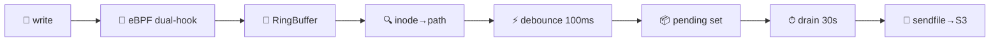

import Tabs from '@theme/Tabs';
import TabItem from '@theme/TabItem';

# Hoard

**eBPF zero-copy file replication to S3.** Hooked at the VFS layer — no application changes needed.



<div className="features">
  <div className="feature-card">
    <div className="feature-icon">🐝</div>
    <div className="feature-title">Dual VFS Hook</div>
    <p><code>fentry/vfs_write</code> + <code>fentry/generic_perform_write</code> catches every buffered write on ext4, tmpfs, btrfs, xfs.</p>
  </div>
  <div className="feature-card">
    <div className="feature-icon">⚡</div>
    <div className="feature-title">Zero-Copy Upload</div>
    <p><code>sendfile(2)</code> from page cache straight to TLS socket. No userspace buffer. No <code>read()</code> syscall.</p>
  </div>
  <div className="feature-card">
    <div className="feature-icon">🗄️</div>
    <div className="feature-title">SQLite Auto-Detect</div>
    <p>WAL checkpoint for <code>.db</code> files before upload. Transparent pass-through for logs, JSON, CSV.</p>
  </div>
  <div className="feature-card">
    <div className="feature-icon">🎯</div>
    <div className="feature-title">BTF CO-RE</div>
    <p>One BPF object, any kernel ≥ 5.5. Verified on 6.1 and 6.12. No per-kernel compilation.</p>
  </div>
  <div className="feature-card">
    <div className="feature-icon">🔀</div>
    <div className="feature-title">Dual-Mode</div>
    <p>Standalone (Unix socket + periodic drain 30s) or Nomad system job (SSE events). Same core pipeline.</p>
  </div>
  <div className="feature-card">
    <div className="feature-icon">📊</div>
    <div className="feature-title">Production Metrics</div>
    <p>8 Prometheus metrics, 5 alert rules, health endpoint, dead-letter queue, exponential retry.</p>
  </div>
</div>

---

## Quick numbers

| Metric | Value |
|--------|-------|
| Binary (stripped) | <span className="badge badge-green">4.2 MB</span> |
| BPF object (CO-RE) | <span className="badge badge-blue">808 KB</span> |
| Runtime RSS | <span className="badge badge-green">~30 MB</span> |
| Kernel | <span className="badge badge-amber">≥ 5.5</span> |
| Rust MSRV | <span className="badge badge-blue">1.82</span> |
| Crate deps | <span className="badge badge-green">22</span> |
| Tests | <span className="badge badge-green">49/49</span> |
| Clippy warnings | <span className="badge badge-green">0</span> |

## 30-second start

<Tabs>
<TabItem value="env" label="Env vars" default>

```bash
HOARD_MODE=standalone \
HOARD_WATCH_ROOT=/var/lib/hoard/volumes \
HOARD_S3_ENDPOINT=http://127.0.0.1:9000 \
HOARD_S3_BUCKET=my-backups \
HOARD_S3_ACCESS_KEY=minioadmin \
HOARD_S3_SECRET_KEY=minioadmin123 \
  hoard
```

</TabItem>
<TabItem value="toml" label="TOML config">

```toml
[daemon]
mode = "standalone"

[watch]
path = "/var/lib/hoard/volumes"

[s3]
endpoint   = "http://127.0.0.1:9000"
bucket     = "my-backups"
access_key = "${S3_ACCESS_KEY}"
secret_key = "${S3_SECRET_KEY}"
```

</TabItem>
</Tabs>

→ **[Full quickstart →](quickstart)**

---

## When to use

| ✅ Perfect for | ❌ Not for |
|---------------|-----------|
| SQLite backup (Litestream-style, S3-native) | Sub-second real-time sync |
| Log / JSON / CSV / Parquet shipping | Append-only streaming (use Kafka) |
| Nomad cluster backup (system job) | Cross-region replication |
| Large file replication (ISO, tar) | Block-level snapshots |

## Status

<div style={{display: 'flex', gap: '0.75rem', flexWrap: 'wrap', margin: '1rem 0'}}>
  <span className="badge badge-green">v1.0.0-beta.1</span>
  <span className="badge badge-green">CI: all green</span>
  <span className="badge badge-green">49 tests</span>
  <span className="badge badge-green">0 clippy warnings</span>
  <span className="badge badge-blue">33/33 #![deny(unsafe_code)]</span>
</div>
