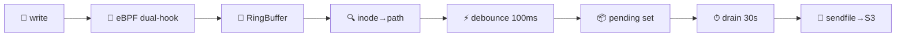

---
hide:
  - navigation
---

# Hoard

**eBPF zero-copy file replication to S3.** Hooked at the VFS layer — no application changes needed.



<div class="grid cards" markdown>

-   🐝 **Dual VFS Hook**

    ---

    `fentry/vfs_write` + `fentry/generic_perform_write` catches every buffered write on ext4, tmpfs, btrfs, xfs.

-   ⚡ **Zero-Copy Upload**

    ---

    `sendfile(2)` from page cache straight to TLS socket. No userspace buffer. No `read()` syscall.

-   🗄️ **SQLite Auto-Detect**

    ---

    WAL checkpoint for `.db` files before upload. Transparent pass-through for logs, JSON, CSV.

-   🎯 **BTF CO-RE**

    ---

    One BPF object, any kernel ≥ 5.5. Verified on 6.1 and 6.12. No per-kernel compilation.

-   🔀 **Dual-Mode**

    ---

    Standalone (Unix socket + periodic drain 30s) or Nomad system job (SSE events). Same core pipeline.

-   📊 **Production Metrics**

    ---

    8 observability metrics, 5 alert rules, health endpoint, dead-letter queue, exponential retry.

</div>

---

## Quick numbers

| Metric | Value |
|--------|-------|
| Binary (stripped) | `4.2 MB` |
| BPF object (CO-RE) | `808 KB` |
| Runtime RSS | `~30 MB` |
| Kernel | `≥ 5.5` |
| Rust MSRV | `1.82` |
| Crate deps | `22` |
| Tests | `49/49` |
| Clippy warnings | `0` |

## 30-second start

=== "Env vars"

    ```bash
    HOARD_MODE=standalone \
    HOARD_WATCH_ROOT=/var/lib/hoard/volumes \
    HOARD_S3_ENDPOINT=http://127.0.0.1:9000 \
    HOARD_S3_BUCKET=my-backups \
    HOARD_S3_ACCESS_KEY=s3admin \
    HOARD_S3_SECRET_KEY=s3admin123 \
      hoard
    ```

=== "TOML config"

    ```toml
    [daemon]
    mode = "standalone"

    [watch]
    path = "/var/lib/hoard/volumes"

    [s3]
    endpoint   = "http://127.0.0.1:9000"
    bucket     = "my-backups"
    access_key = "${S3_ACCESS_KEY}"
    secret_key = "${S3_SECRET_KEY}"
    ```

→ **[Full quickstart →](quickstart.md)**

---

## When to use

| ✅ Perfect for | ❌ Not for |
|---------------|-----------|
| SQLite backup (continuous WAL-based, S3-native) | Sub-second real-time sync |
| Log / JSON / CSV / Parquet shipping | Append-only streaming (use a message broker) |
| Nomad cluster backup (system job) | Cross-region replication |
| Large file replication (ISO, tar) | Block-level snapshots |

## Status

`v1.0.0-beta.1` · CI all green · 49 tests · 0 clippy · 33/33 deny(unsafe_code) · 8 observability metrics
