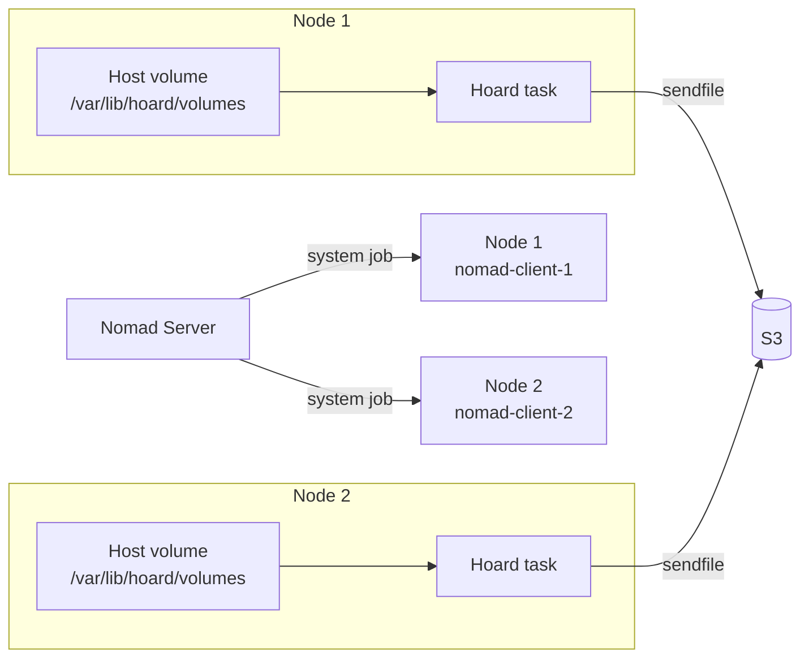

# Nomad deployment

## Overview

Hoard can run as a Nomad system job — one task per client node, watching a
host volume and backing up to S3.



## Job specification

```hcl
job "hoard" {
  datacenters = ["dc1"]
  type        = "system"

  group "hoard" {
    task "hoard" {
      driver = "exec"

      config {
        command = "local/hoard"
        args    = ["--config", "local/hoard.toml"]
      }

      artifact {
        source      = "https://github.com/hoard-project/hoard/releases/latest/download/hoard-x86_64"
        destination = "local/hoard"
        mode        = "file"
        options {
          checksum = "sha256:https://github.com/hoard-project/hoard/releases/latest/download/hoard-x86_64.sha256"
        }
      }

      artifact {
        source      = "https://github.com/hoard-project/hoard/releases/latest/download/hoard-x86_64.bpf.o"
        destination = "local/hoard.bpf.o"
        mode        = "file"
        options {
          checksum = "sha256:https://github.com/hoard-project/hoard/releases/latest/download/hoard-x86_64.bpf.o.sha256"
        }
      }

      template {
        data = <<EOF
HOARD_MODE=nomad
HOARD_WATCH_PATH={{ env "NOMAD_ALLOC_DIR" }}/volumes
HOARD_S3_ENDPOINT=http://s3.service.consul:9000
HOARD_S3_BUCKET=hoard-backups
HOARD_S3_ACCESS_KEY={{ with secret "kv/data/s3" }}{{ .Data.data.access_key }}{{ end }}
HOARD_S3_SECRET_KEY={{ with secret "kv/data/s3" }}{{ .Data.data.secret_key }}{{ end }}
HOARD_METRICS_ADDR=0.0.0.0:9150
HOARD_WATCH_PATTERNS=*
HOARD_S3_NO_SIGN=true
EOF
        destination = "secrets/.env"
        env         = true
      }

      resources {
        cpu    = 200
        memory = 128
      }

      volume_mount {
        volume      = "watch-root"
        destination = "{{ env \"NOMAD_ALLOC_DIR\" }}/volumes"
      }
    }

    volume "watch-root" {
      type      = "host"
      read_only = false
      source    = "hoard-volumes"
    }

    network {
      port "metrics" {
        static = 9150
      }
    }

    service {
      name = "hoard-metrics"
      port = "metrics"

      check {
        type     = "http"
        path     = "/health"
        interval = "15s"
        timeout  = "5s"
      }
    }
  }
}
```

## Deployment

```bash
# Create host volume directory on each node
ssh nomad-client-1 "mkdir -p /var/lib/hoard/volumes"
ssh nomad-client-2 "mkdir -p /var/lib/hoard/volumes"

# Submit
nomad job run contrib/nomad/hoard.nomad

# Verify
nomad job status hoard
nomad alloc status $(nomad job allocs -t '{{ range . }}{{ if eq .ClientStatus "running" }}{{ .ID }}{{ end }}{{ end }}' hoard)
```

## Nomad mode vs standalone

| Feature | Standalone | Nomad |
|---------|-----------|-------|
| Socket | Unix domain (`/var/run/hoard.sock`) | **None** |
| Metrics | `0.0.0.0:9150` | Nomad service check |
| Config | Env vars or TOML file | Nomad template + Vault |
| Drain signal | SIGUSR1 | SIGTERM → `on_stop = "drain"` |
| Lifecycle | systemd | Nomad scheduler |
| Upgrade | Binary replace + restart | `nomad job run` + rolling update |

## Health check

```bash
# Nomad health
nomad job status hoard

# Direct HTTP check (from any cluster node)
curl http://nomad-client-1:9150/health
# {"status":"ok"}

# Application metrics
curl http://nomad-client-1:9150/metrics | grep hoard_
```
