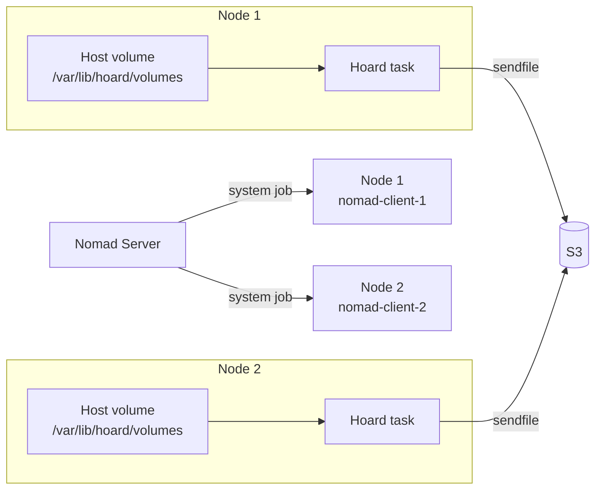

# Nomad deployment

## Overview

Hoard can run as a Nomad system job — one task per client node, watching a
host volume and backing up to S3.



## Job specification

```hcl
job "hoard" {
  datacenters = ["dc1"]
  type        = "system"

  group "hoard" {
    task "hoard" {
      driver = "raw_exec"  # exec runs as nobody → no BPF privileges

      config {
        command = "local/hoard"
        args    = ["--config", "local/hoard.toml"]
        user    = "root"  # required by BPF
      }

      artifact {
        source      = "https://github.com/hoard-project/hoard/releases/latest/download/hoard-x86_64"
        destination = "local/hoard"
        mode        = "file"
        options {
          checksum = "sha256:https://github.com/hoard-project/hoard/releases/latest/download/hoard-x86_64.sha256"
        }
      }

      artifact {
        source      = "https://github.com/hoard-project/hoard/releases/latest/download/hoard-x86_64.bpf.o"
        destination = "local/hoard.bpf.o"
        mode        = "file"
        options {
          checksum = "sha256:https://github.com/hoard-project/hoard/releases/latest/download/hoard-x86_64.bpf.o.sha256"
        }
      }

      template {
        data = <<EOF
[hoard]
version = 2
[daemon]
mode = "nomad"
service = "hoard"
metrics_addr = "0.0.0.0:9150"
[watch]
paths = ["{{ env "NOMAD_ALLOC_DIR" }}/volumes"]
[s3]
endpoint = "http://s3.service.consul:9000"
region = "us-east-1"
bucket = "hoard-backups"
access_key = "{{ with secret "kv/data/s3" }}{{ .Data.data.access_key }}{{ end }}"
secret_key = "{{ with secret "kv/data/s3" }}{{ .Data.data.secret_key }}{{ end }}"
no_sign = true
[defaults]
prefix = "hoard"
ttl = "30d"
retries = 3
extensions = ["*"]
compression = "zstd"
on_stop = "drain"
on_delete = "keep"
EOF
        destination = "local/hoard.toml"
      }

      resources {
        cpu    = 200
        memory = 128
      }

      volume_mount {
        volume      = "watch-root"
        destination = "{{ env \"NOMAD_ALLOC_DIR\" }}/volumes"
      }
    }

    volume "watch-root" {
      type      = "host"
      read_only = false
      source    = "hoard-volumes"
    }

    network {
      port "metrics" {
        static = 9150
      }
    }

    service {
      name = "hoard-metrics"
      port = "metrics"

      check {
        type     = "http"
        path     = "/health"
        interval = "15s"
        timeout  = "5s"
      }
    }
  }
}
```

## Deployment

```bash
# Create host volume directory on each node
ssh nomad-client-1 "mkdir -p /var/lib/hoard/volumes"
ssh nomad-client-2 "mkdir -p /var/lib/hoard/volumes"

# Submit
nomad job run contrib/nomad/hoard.nomad

# Verify
nomad job status hoard
nomad alloc status $(nomad job allocs -t '{{ range . }}{{ if eq .ClientStatus "running" }}{{ .ID }}{{ end }}{{ end }}' hoard)
```

## Nomad mode vs standalone

| Feature | Standalone | Nomad |
|---------|-----------|-------|
| Socket | Unix domain (`/var/run/hoard.sock`) | **None** |
| Metrics | `0.0.0.0:9150` | Nomad service check |
| Config | Env vars or TOML file | Nomad template + Vault |
| Drain signal | SIGUSR1 | SIGTERM → `on_stop = "drain"` |
| Lifecycle | systemd | Nomad scheduler |
| Upgrade | Binary replace + restart | `nomad job run` + rolling update |

## BPF privileges

Hoard requires `CAP_BPF` + `CAP_SYS_ADMIN` to load eBPF programs. The
`exec` driver runs tasks as `nobody` and **cannot** support BPF. Use
`raw_exec` instead — it runs directly on the host as the Nomad agent user
(typically `root`).

```hcl
driver = "raw_exec"
```

If you must use `exec` for security isolation, hoard falls back to inotify
polling — slower but functional. Set `HOARD_BPF_DISABLE=true` to skip BPF
loading entirely.

```bash
# Nomad health
nomad job status hoard

# Direct HTTP check (from any cluster node)
curl http://nomad-client-1:9150/health
# {"status":"ok"}

# Application metrics
curl http://nomad-client-1:9150/metrics | grep hoard_
```
